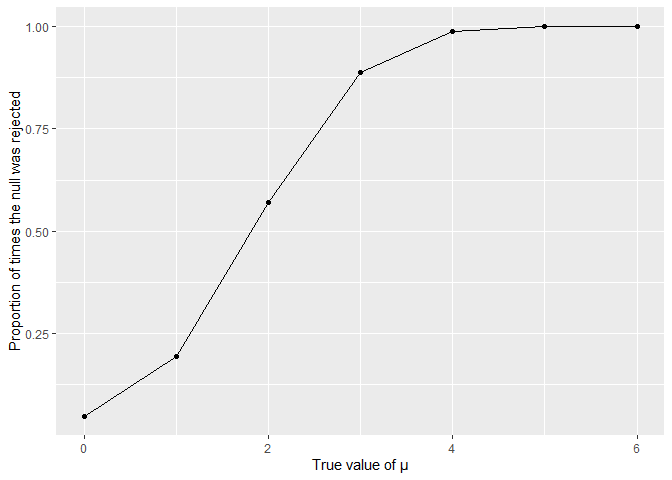
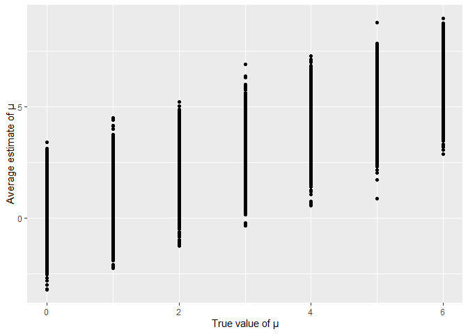
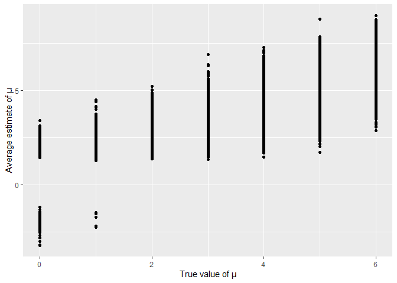

Homework 5
================
Krishna Vemulapalli

``` r
library(tidyverse)
library(ggplot2)
library(knitr)
library(janitor)
library(purrr)
```

## Problem 1

Describing the raw dataset:

``` r
raw_df = read.csv("data/homicide-data.csv")
```

This dataset consists of data associated with homocides from 50
differnet US cities and this information was put together by The
Washington Post. This dataset contains the following variables: uid,
reported\_date, victim\_last, victim\_first, victim\_race, victim\_age,
victim\_sex, city, state, lat, lon, disposition. The dimensions of the
dataset are as follows: 52179, 12(rows, columns).

Reading and cleaning the dataset. Followed by, creating a city\_state
variable and summarizing within cities.

``` r
homocide_df = 
  read.csv("data/homicide-data.csv") %>%
  mutate(
    city_state = str_c(city, state, sep = ", "), #creating the city_state variable#
    homocide_status = case_when(
     disposition == "Open/No arrest" ~ "unsolved",
     disposition == "Closed without arrest" ~ "unsolved",
     disposition == "Closed by arrest" ~ "solved"
    ) #creating the homocide status variable#
  ) %>%
  clean_names()

summary_df = 
  homocide_df %>%
  filter(city_state != "Tulsa, AL") %>% #removed the "Tulsa, AL" obs because it has only one unsolved homocide. This indicates a data entry mistake#
  select(city_state, homocide_status) %>% #keeping only city_state and homocide_status variable#
  group_by(city_state) %>%
  summarise(
    total_no_homocides = n(),
    no_unsolved_homocides = sum(homocide_status == "unsolved")
  ) #calculating the total homocides and number of unsolved homocides by city_state#
```

    ## `summarise()` ungrouping output (override with `.groups` argument)

``` r
summary_df %>%
  kable()
```

| city\_state        | total\_no\_homocides | no\_unsolved\_homocides |
| :----------------- | -------------------: | ----------------------: |
| Albuquerque, NM    |                  378 |                     146 |
| Atlanta, GA        |                  973 |                     373 |
| Baltimore, MD      |                 2827 |                    1825 |
| Baton Rouge, LA    |                  424 |                     196 |
| Birmingham, AL     |                  800 |                     347 |
| Boston, MA         |                  614 |                     310 |
| Buffalo, NY        |                  521 |                     319 |
| Charlotte, NC      |                  687 |                     206 |
| Chicago, IL        |                 5535 |                    4073 |
| Cincinnati, OH     |                  694 |                     309 |
| Columbus, OH       |                 1084 |                     575 |
| Dallas, TX         |                 1567 |                     754 |
| Denver, CO         |                  312 |                     169 |
| Detroit, MI        |                 2519 |                    1482 |
| Durham, NC         |                  276 |                     101 |
| Fort Worth, TX     |                  549 |                     255 |
| Fresno, CA         |                  487 |                     169 |
| Houston, TX        |                 2942 |                    1493 |
| Indianapolis, IN   |                 1322 |                     594 |
| Jacksonville, FL   |                 1168 |                     597 |
| Kansas City, MO    |                 1190 |                     486 |
| Las Vegas, NV      |                 1381 |                     572 |
| Long Beach, CA     |                  378 |                     156 |
| Los Angeles, CA    |                 2257 |                    1106 |
| Louisville, KY     |                  576 |                     261 |
| Memphis, TN        |                 1514 |                     483 |
| Miami, FL          |                  744 |                     450 |
| Milwaukee, wI      |                 1115 |                     403 |
| Minneapolis, MN    |                  366 |                     187 |
| Nashville, TN      |                  767 |                     278 |
| New Orleans, LA    |                 1434 |                     930 |
| New York, NY       |                  627 |                     243 |
| Oakland, CA        |                  947 |                     508 |
| Oklahoma City, OK  |                  672 |                     326 |
| Omaha, NE          |                  409 |                     169 |
| Philadelphia, PA   |                 3037 |                    1360 |
| Phoenix, AZ        |                  914 |                     504 |
| Pittsburgh, PA     |                  631 |                     337 |
| Richmond, VA       |                  429 |                     113 |
| Sacramento, CA     |                  376 |                     139 |
| San Antonio, TX    |                  833 |                     357 |
| San Bernardino, CA |                  275 |                     170 |
| San Diego, CA      |                  461 |                     175 |
| San Francisco, CA  |                  663 |                     336 |
| Savannah, GA       |                  246 |                     115 |
| St. Louis, MO      |                 1677 |                     905 |
| Stockton, CA       |                  444 |                     266 |
| Tampa, FL          |                  208 |                      95 |
| Tulsa, OK          |                  583 |                     193 |
| Washington, DC     |                 1345 |                     589 |

Estimating the proportion of homicides that are unsolved in Baltimore,
MD

``` r
baltimore_MD_prop_test = 
  prop.test(
  summary_df %>% filter(city_state == "Baltimore, MD") %>% pull(no_unsolved_homocides),
  summary_df %>% filter(city_state == "Baltimore, MD") %>% pull(total_no_homocides))

#Applying the broom::tidy to convert the output into a tibble#
baltimore_MD_prop_test %>% 
  broom::tidy() %>%
  select(estimate, conf.low, conf.high) #selecting only the estimate and confidence intervals
```

    ## # A tibble: 1 x 3
    ##   estimate conf.low conf.high
    ##      <dbl>    <dbl>     <dbl>
    ## 1    0.646    0.628     0.663

Estimating the proportion of homicides that are unsolved and creating
estimate and confidence intervals for each city\_state

``` r
city_state_prop_test =
  summary_df %>%
  mutate(
    prop_test = map2(.x = no_unsolved_homocides, .y = total_no_homocides, ~prop.test(.x, .y)),
    prop_test_tidy = map(.x = prop_test, ~broom::tidy(.x))
  ) %>%
  select(-prop_test) %>% #dropping prop_test variable#
  unnest(prop_test_tidy) %>% #unnesting prop_test_tidy variable#
  select(city_state, estimate, conf.low, conf.high) %>% #subsetting only the city_state, estimate and confidence intervals#
  arrange(desc(estimate)) #Organizing cities according to the proportion of unsolved homicides#
```

Creating a plot that shows the estimates and CIs for each city

``` r
city_state_prop_test %>%
  mutate(city_state = fct_reorder(city_state, estimate)) %>%
  ggplot(aes(x = city_state, y = estimate)) +
  geom_point() +
  geom_errorbar(aes(ymin = conf.low, ymax = conf.high)) +
  theme(axis.text.x = element_text(angle = 90)) +
  ylab("Proportion of Unsolved Homicides") + 
  xlab("City, State")
```

<!-- -->

## Problem 2

Creating a dataframe containing all the csv filenames

``` r
long_fnames_df = 
  tibble(fname = list.files("data/data_long")) %>%
  mutate(
    path = str_c("data/data_long/", fname),
    obs = map(.x = path, ~read_csv(.x))
  )
```

creating a dataframe consisting of all the subjects and their respective
observations

``` r
long_df = 
  long_fnames_df %>%
  separate(fname, into = c("study_arm", "study_id", sep = ".")) %>%
  select(-c(".", "path")) %>%
  unnest(obs) %>%
  pivot_longer(
    cols = week_1:week_8,
    names_to = "week_type",
    values_to = "observations"
  ) %>%
  mutate(
    study_id = as.numeric(study_id),
    study_arm = case_when(
      study_arm == "con" ~ "control",
      study_arm == "exp" ~ "experimental"
    ),
    study_arm = as.factor(study_arm),
    week_type = as.factor(week_type)
  )
```

Creating a spaghetti plot showing observations on each subject over time

``` r
long_df %>%
  ggplot(aes(x = week_type, y = observations, group = study_id, color = study_arm)) +
  geom_line() +
  facet_grid(~study_arm) +
  theme(axis.text.x = element_text(angle = 45)) +
  ylab("Observations") + 
  xlab("Week Type")
```

<!-- -->
Between the two study arms, the subjects from the experimental group
appear to demonstrate a positive trend (gradual increase) in their
observation over the 8-week time period when compared to the subjects
from control group. The subjects from the control displayed somewhat
consistent observations over the study duration. The observations
associated with the experimental group subjects indicate a positive
slope, while the control group subject observations depict a slope of
value around 0.

## Problem 3

Creating a function to obtain the estimate of mean, p-value and decision
for fixed n = 30 and sd = 5

``` r
sim_mean_pval = function(mu = 0) {
  sim_data  = 
    tibble(
      x = rnorm(n = 30, mean = mu, sd = 5)
    )
  
  sim_data %>%
    t.test(mu = 0) %>% #the default alpha value is 0.05#
    broom::tidy() %>%
    mutate(
      true_mu = mu,
      decision = as.factor(case_when(
        p.value <= 0.05 ~ "reject",
        p.value > 0.05 ~ "fail to reject"
      ))
        ) %>%
    select(true_mu, estimate, p.value, decision)
}
```

Simulating the function created above 5000 times for various mean values
and subsequently storing the results in a dataframe.

``` r
set.seed(200)

#Case when mu = 0#
output_mu_0 = 
  rerun(5000, sim_mean_pval(mu = 0)) %>%
  bind_rows() 

output_mu_0 = output_mu_0 %>%
  mutate(
    prop_reject = output_mu_0 %>% filter(decision == "reject") %>% count() %>% pull()/ 5000
  )

#Case when mu = 1#
output_mu_1 = 
  rerun(5000, sim_mean_pval(mu = 1)) %>%
  bind_rows()

output_mu_1 = output_mu_1 %>%
  mutate(
    prop_reject = output_mu_1 %>% filter(decision == "reject") %>% count() %>% pull() / 5000
  )

#Case when mu = 2#
output_mu_2 = 
  rerun(5000, sim_mean_pval(mu = 2)) %>%
  bind_rows() 

output_mu_2 = output_mu_2 %>%
  mutate(
    prop_reject = output_mu_2 %>% filter(decision == "reject") %>% count() %>% pull() / 5000
  )

#Case when mu = 3#
output_mu_3 = 
  rerun(5000, sim_mean_pval(mu = 3)) %>%
  bind_rows() 

output_mu_3 = output_mu_3 %>%
  mutate(
    prop_reject = output_mu_3 %>% filter(decision == "reject") %>% count() %>% pull() / 5000
  )

#Case when mu = 4#
output_mu_4 = 
  rerun(5000, sim_mean_pval(mu = 4)) %>%
  bind_rows() 

output_mu_4 = output_mu_4 %>%
  mutate(
    prop_reject = output_mu_4 %>% filter(decision == "reject") %>% count() %>% pull()/ 5000
  )

#Case when mu = 5#
output_mu_5 = 
  rerun(5000, sim_mean_pval(mu = 5)) %>%
  bind_rows() 

output_mu_5 = output_mu_5 %>%
  mutate(
    prop_reject = output_mu_5 %>% filter(decision == "reject") %>% count() %>% pull()/ 5000
  )

#Case when mu = 6#
output_mu_6 = 
  rerun(5000, sim_mean_pval(mu = 6)) %>%
  bind_rows() 

output_mu_6 = output_mu_6 %>%
  mutate(
    prop_reject = output_mu_6 %>% filter(decision == "reject") %>% count() %>% pull()/ 5000
  )

#Binding the rows from the dataframes to create one final dataframe#

output = 
  bind_rows(output_mu_0, output_mu_1, output_mu_2, output_mu_3, output_mu_4, output_mu_5, output_mu_6) 
```

Creating a plot to show the proportion of times the null was rejected on
the y axis and the true value of μ on the x axis.

``` r
output %>% 
  ggplot(aes(x = true_mu, y = prop_reject)) +
  geom_point() +
  geom_line() +
  xlab("True value of μ") +
  ylab("Proportion of times the null was rejected")
```

<!-- -->
Based on the graph, we can infer that the effect size and power are
positively correlated. As the effect size increases, one will most
likely reject the null hypothesis resulting in increased power.

Creating a plot to show the average estimate of μ on the y axis and the
true value of μ on the x axis

``` r
output %>%
  ggplot(aes(x = true_mu, y = estimate)) +
  geom_point() +
  xlab("True value of μ") +
  ylab("Average estimate of μ")
```

<!-- -->

Creating a plot to show the average estimate of μ only in samples for
which the null was rejected on the y axis and the true value of μ on the
x axis.

``` r
output %>%
  filter(decision == "reject") %>%
  ggplot(aes(x = true_mu, y = estimate)) +
  geom_point() +
  xlab("True value of μ") +
  ylab("Average estimate of μ")
```

<!-- -->
No, the sample average of μ across tests for which the null is rejected
is not equal to the true value of μ. This can be observed from the wide
range of sample averages of μ, compared to their respective true values
of μ. The spread of average μ values increases with the increasing value
of true μ.
